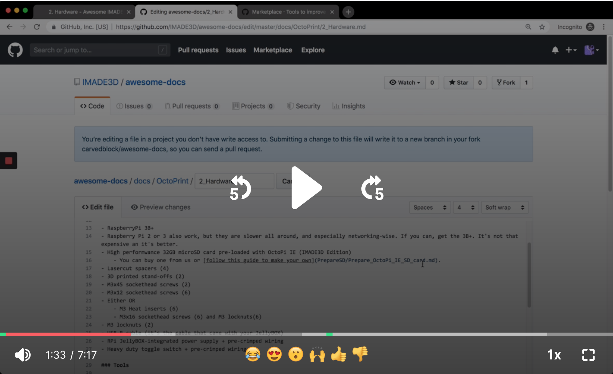

# AWESOME IMADE3D DOCS

These are 'plain text' docs for IMADE3D products. The advantages are that these are portable, future-proof, and easily editable by anyone.

## How to Contribute

> Don't worry, you cannot break anything. The system is protected against that. So Edit away!!!

1. Go to /docs folder and find the markdown file you wish to edit. All files are plain text markdown.
1. Edit the file.
1. Submit a Pull Request with a justification of your proposed changes.
1. We will review the changes and either ask you to amend your proposal or accept them!

## License

This work is licensed under a [Creative Commons Attribution-ShareAlike 4.0 International License.](http://creativecommons.org/licenses/by-sa/4.0/)

You are free to:
- **Share** — copy and redistribute the material in any medium or format
- **Adapt** — remix, transform, and build upon the material
for any purpose, even commercially.

But only under the following terms:
- **Attribution** — You **must give appropriate credit**, provide a link to the license, and indicate if changes were made. You may do so in any reasonable manner, but not in any way that suggests the licensor endorses you or your use.
- **ShareAlike** — If you remix, transform, or build upon the material, you **must distribute your contributions under the same license** as the original.

> **If you are interested in licensing this work or part thereof under a different license (bet it Commercial or Free Culture license), get it touch with IMADE3D LLC. We are happy to talk.**

 This work is licensed under a <a rel="license" href="http://creativecommons.org/licenses/by-sa/4.0/">Creative Commons Attribution-ShareAlike 4.0 International License</a>.