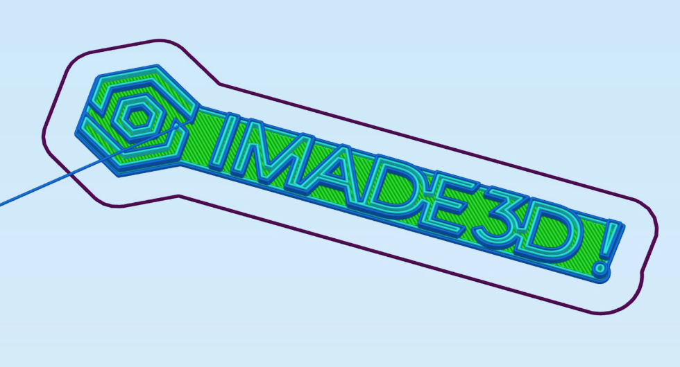

## Print Stuff!

When you are happy your first layer, get out there and print something nice.

To verify, you can print the [IMADE3D First Print](go.imade3d.com/first-layer) (Our Logo with the 1st layer designed to be fast to print and easy to judge) or [IMADE3D Second Print (Part Scraper)](https://docs.imade3d.com/Guide/01.+Print+the+Part+Scraper/595?lang=en#s1777)

Check out the verified printable things on [MyMiniFactory](https://www.myminifactory.com/pages/explore), browse the [popular things on Thingiverse](https://www.thingiverse.com/explore/popular), or roam the free world of [YouMagine](https://www.youmagine.com/designs/popular). (There are tons of other source...)

[download_calibrate]: https://raw.githubusercontent.com/IMADE3D/JellyBOX-Essentials/master/GCODES%20-%20ready%20to%20print/1-Your%20First%20Print/PLA/First%20PLA%20print%20-%20210x45.gcode

[download_sd]: go.imade3d.com/sd-card

[perfect_first]: #perfect_1st
