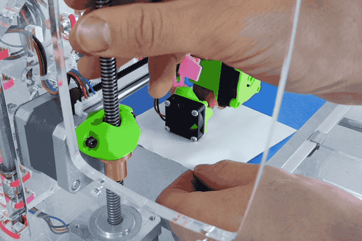

# Position the Z Probe
> This guide presumes you use an adjustable Z probe mount. If your mount has a single hole, just skip this section. 

### What You'll Need
- M3 (2.5mm) hex key
- A piece of office paper (or similar thickness; post-it note, etc.)
- A Z probe spacer
    - It's a 3D printed spacer that ships with the JellyBOX.
    - You can download and print your own from here.
    
      

[//]: # ( #TODO add a link to github)

- If you don't have the proper Z probe spacer, you can also use a transparent cable tie. Read more information in the [FAQ](FAQ?id=spacer).

## Experience the Sensing Distance

Turn on you JellyBOX and move the X axis so that you can see a red light on your Z probe.
 - If your Z probe is yellow, then the light is on the bottom.
 - If your Z probe is green, then the light is on the front.

Try to approach the sensing area with a hex key, tweezers or other piece of metal (_but not_ stainless steel). The red light should **turn off** when the sensor senses the metal. 

[comment]:: ( #todo git from the vid check endstops_1.mp4)

You'll notice that the light goes off when the metal is about **2mm** (0.08'') from the sensor. This is the sensing distance.

## Make the nozzle touch the build plate

Loosen the M3 screw holding the z probe in place so that the probe can move freely. 

Move the extruder so that the nozzle is around the center of the build plate.

### 🎦 Video: Feel the nozzle with paper

Turn the z lead screw with your hand until the nozzle is lightly touching the build plate. The easiest way to do this is **by touch**. 

Slide a piece of office paper underneath the nozzle and keep moving it back and forth all the while lowering the nozzle. When you can't move the paper freely back-and-forth that's when the nozzle is touching the plate.

---

### Position the Z probe 1mm above the nozzle

We need the gap between the tip of the nozzle and bottom of the z probe to be about 1 mm. This guarantees the plate will be sensed by the Z probe before the nozzle hits it.

Rest the Z probe on top of the Z probe Spacer and tighten in place.

Use the Z probe spacer if you have it even though the image uses a zip tie.

!> Now, there should be just about 1mm gap between the tip of the nozzle and the probe.

## Verify the build plate is within sensing distance

Move the X assembly slightly up again (rotate the screw with your hand) and watch out for the red light on the Z probe. Did it turn on?

Try to lower the Z assembly back down and observe the light. When if turns off, stop. The nozzle must be above the build plate; not touching it.

If the nozzle is touching the build plate, something went wrong. Start from the top and try again.

## Position the Left Filament Cooling Fan

This is a great opportunity to also position the left cooling fan. 

Good cooling is essential for quality prints from many materials. For PLA, for example, it's a _must_.

Use the same method you used for the Z probe
- Loosen up the mount
- Rest the fan on the Z Probe Spacer (or on a flat zip tie)
- Tighten the mount again.

> There should be about 1mm gap between the lowest point of the fan and the tip of the nozzle.

