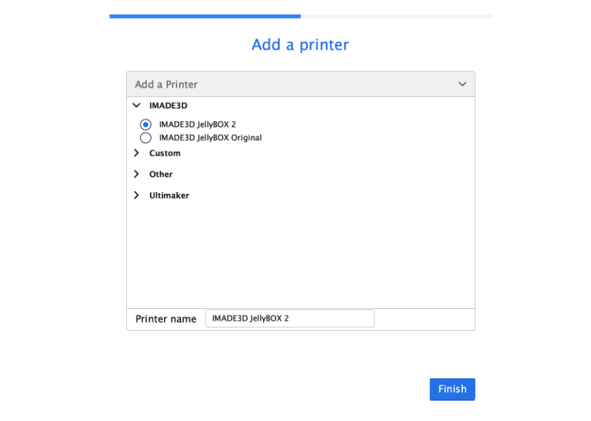
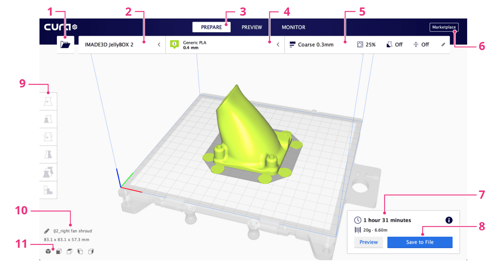
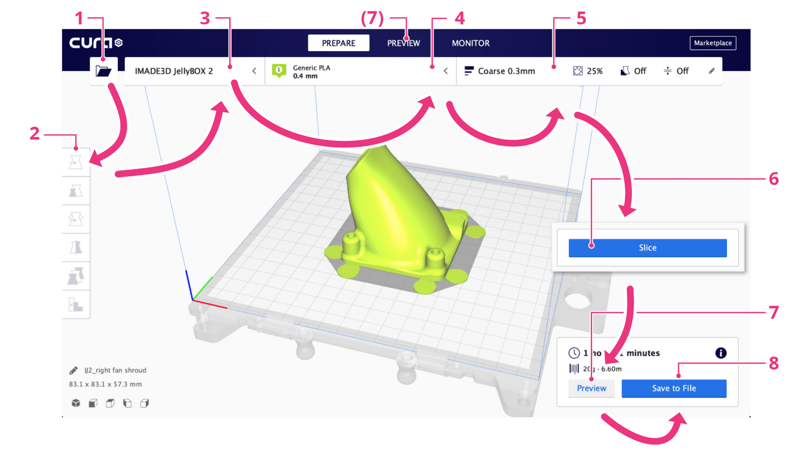
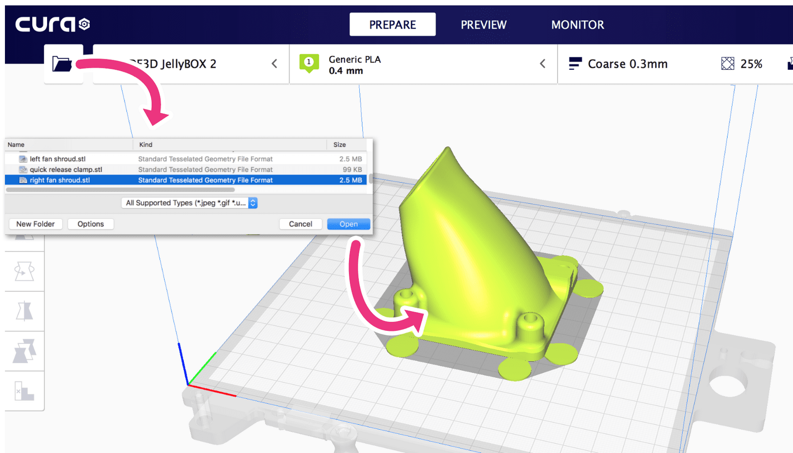
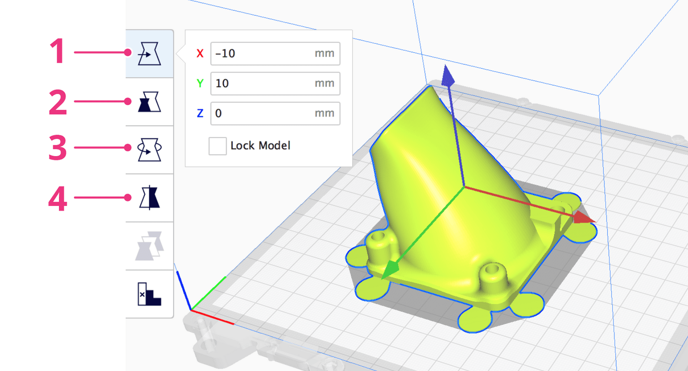
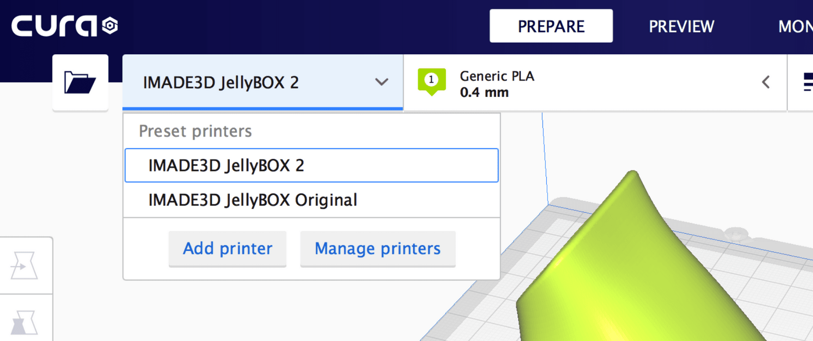
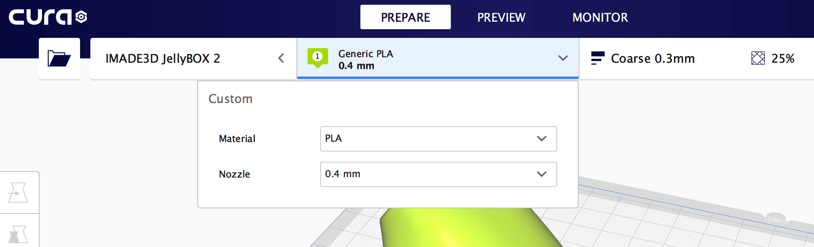
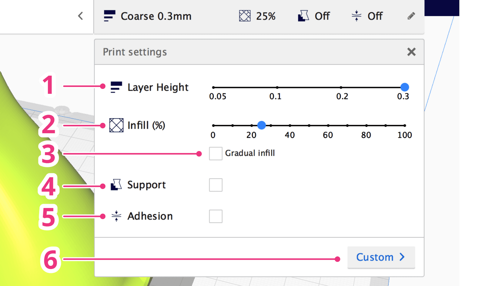
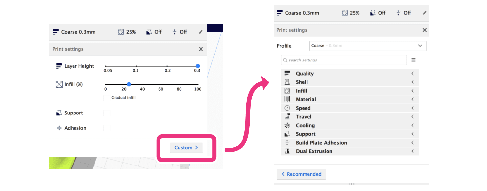
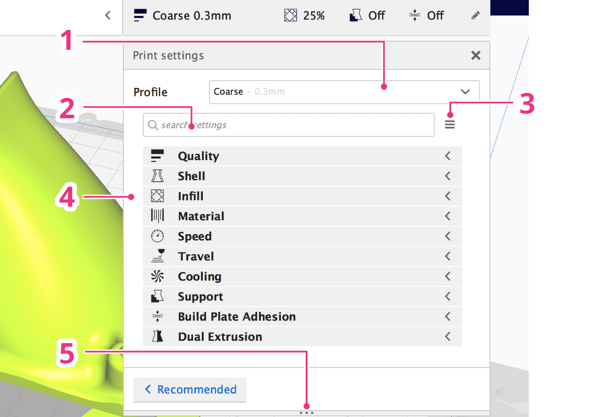

<!--
Title: Cura IMADE3D Edition Quick Start Guide
Date Format: %m/%d/%Y
Print Footer Right: Last updated %date | www.imade3d.com
Print Footer Left: Page %page of %total

-->
!> `🏷 Guide version 1.2 ↦ for Cura IE 4.1`

[⬇ Download as a PDF](Cura-Quick-Start-Guide/Cura-Quick-Start-Guide-version-1.2-for-Cura-IE-4.1.pdf ":ignore")

# Cura IMADE3D Edition Quick Start Guide

_Cura is "slicer": a program that converts 3D models into instructions for 3D printers by "slicing" the models into thing horizontal slices. Without Cura, you would have no good way of telling your JellyBOX what to print!_

_Naming Note: Cura is open-source. Since version 3.04, "Cura" has the most common Cura is known as "Ultimaker Cura" to signify Ultimaker's role in chaperoning the development of this gem. Cura IMADE3D Edition is a customized Cura that features only supported functions, with the latest and greatest slicing settings for your JellyBOX._

<!-- **Table of Contents** -->
<!-- TOC max1 -->

## Installation

Download the latest Cura IMADE3D Edition @ [go.imad3d.com/cura-download](go.imad3d.com/cura-download)

!> This guide is for Cura IE version 4. Cura 4.1 IE is currently in Beta.

### System Requirements

Compatible operating systems
- Windows 7 or higher, 64 bit
- Mac OSX 10.11 or higher, 64 bit
- Ubuntu 14.04 or higher, 64 bit

Minimum system requirements
- OpenGL 2 compatible graphics card, OpenGL 4.1 for 3D layer view
- Display resolution 1024 x 768
- Intel Core 2 or AMD Athlon 64
- 550 MB available hard disk space
- 4GB RAM memory

Recommended system requirements
- OpenGL 4.1 compatible graphics card for 3D layer view
- Display resolution 1920 x 1080
- Intel Core i3 or AMD Athlon 64
- 600 MB available hard disk space
- 8GB RAM memory

## Initial Setup

_Cura on your computer may look a bit different depending on your system and Cura version._

When you open Cura for the first time, you may have to agree to the User Agreement. You will also have the option to allow or disable collection of _anonymous_ slicing data that is used to help develop future Cura versions.

A setup wizard will start automatically if this is your first time running this Cura version. Select what printer you have: `JellyBOX` or `JellyBOX 2`.

(Later, you can add additional machines by going to Settings > Printer)

## Cura Interface
After you add your first printer, you see the main Cura screen.

1. **Open file.** Loads a 3D model or Cura project.
2. **Select printer.**
3. **Switch between 'stages.'** The Prepare and Preview stages will be your home base.
4. **Select material and nozzle.**
5. **Print settings panel.** Contains all slicing settings.
6. **Marketplace.** Here you can download and install plugins and materials.
7. **Slicing information.** This area shows different things depending on what's happening.
8. **Export.** Save as .gcode, export to a removable drive, and more.
9. **Preview.** This will be your favorite button: it takes you to the Preview stage.
10. **View angles.** Here's some default angles for your convenience.
11. **3D Model information.**

## The Typical Slicing WorkFlow

1. **Load a model**
2. **Adjust the model** (rotate, resize...)
3. **Select the printer**
4. **Select the material and the nozzle**
5. **Select a printing profile** and/or **modify** the slicing settings
6. **Slice** (unless _auto-slicing_ is enabled in the Settings)
7. **Preview**. Always Be Previewing!
8. **Export the .gcode** and print

### 1. Load a 3D model

### 2. Adjust the model

Often, you will need to re-orient the model either to align the layers for maximum strength or to print without supports. You can also arrange multiple models as you see fit.

1. **Move/ transform**
2. **Resize**
3. **Rotate**
4. **Mirror**

### 3. Select the printer

Unless you have many machines, this one is set and forget.

### 4. Select the material and the nozzle

Different materials carry different temperature and speed settings.

### 5. Select a printing profile and/or modify the slicing settings

Right away, you can adjust some of the most common settings.

1. **Layer height.**
2. **Infill.** Choose an infill percentage by dragging the slider.
3. **Enable gradual infill.** Reduces the amount of infill in your print by gradually increasing density. This only works well with some infills and you should use Preview to verify results.
4. **Enable support.** This function automatically generates support structures below overhanging parts of a model to prevent the model from sagging or printing mid-air.
5. **Enable build plate adhesion.** Simply put, this adds a brim or a raft to your print, both of which are ways to prevent your print from warping or detaching. In general, these are used as a remedial setting - applied only when needed.
6. **Enter the Custom mode.** Here's where you will find ALL slicing settings. It's the _Power User's Dream._

### Custom Mode

In the Custom mode, you can select included or custom slicing presets or modify any setting.

1. **Select a profile**
2. **Search all settings**
3. **Manage settings visibility** (There are _too many_ settings. Unless you're an expert, it's wise to hide advanced settings.)
4. **Browse settings by categories**
5. **Resize the Custom window** (drag up/down)

## FAQ

### Where can I find information on Cura IE Online?

For all things Cura IE @ [go.imade3d.com/cura](go.imade3d.com/cura)

### What are the Common Slicing Profiles Good For

- **Coarse**
    - **0.3mm** layer height
    - Prints the strongest parts in the least amount of time. Your printed part with have clearly visible 0.3 mm thick layers. A clear choice for protoryping and quick prints.
- **Medium**
    - **0.2mm** layer height
    - Prints slower and slightly(!) more brittle parts than Coarse. Better for printing steeper overhangs and small features. It's a common middle ground for general use.
- **Fine**
    - **0.1mm** layer height
    - Prints slower and slightly more brittle parts than Medium. Great for printing steep overhangs and small features. Smooth-looking.
- **UltraFine**
    - **0.05mm** layer height
    - Takes a very long time to print (even days). Produces curiously smooth prints and amazing overhangs.

### Heated Bed ?

- All our slicing profiles **include heated bed settings** by **default**.

?> **Cold bed JellyBOXes ignore** the heated bed instructions. So, you **can** run gcodes with heated bed settings on a cold bed JellyBOX. No problem.

- We highly recommend the heated bed upgrade to print a wider variety of plastics, for example PETG.
- In general, you _do not_ need a heated bed for most prints with _PLA_. PLA stick well to blue painter's tape, and you don't have to wait for the bed to heat up.

## Info for Legacy Hotends (Pre-2017)

- If your hotend looks like this, with the heat block only 10mm long (current default is 20mm), then you have some old old JellyBOX, congrats on being a super-early adopter!
- In general, you may need to **set your material print temperature 10C higher** than the current JellyBOX profiles else you're may have under extrusion problems.
- Alternatively, print up to 50% slower.

