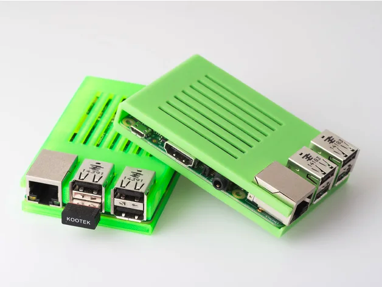
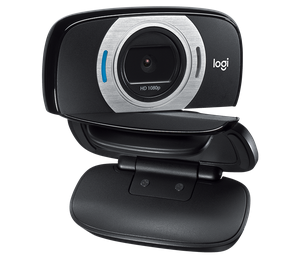

# FAQ

## Can I Keep the RPi outside of JellyBOX? Should I make a case for it?

You bet. If you want to keep the Pi outside of your JellyBOX, for example because you have multiple JellyBOXes and want to switch between which one is remotely controlled, go ahead. 

We recommend you 3D print a case for you Pi in that case! Otherwise you **run** the **risk of shorting the contacts on the Pi and destroying it**.

Here's one of our favorite cases by Walter Hsiao. It's fast and easy to print, one piece, and protects the Pi in an elegant fashion.

https://www.myminifactory.com/object/3d-print-cover-for-raspberry-pi-3-42727
[https://www.thingiverse.com/thing:2320678](<https://www.thingiverse.com/thing:2320678>)

## What Webcam Options do I Have?

We are unsure ourselves what is the best webcam position - this also depends on what webcam you have.

The easiest mounting option is to drill a hole into the top acrylic piece and put the webcam just to the left or right of the filament spool, as far forward as possible, pointing down at the plate. This works well and it's Ladi's favorite placement.

One camera that works well in this setup and can be found for less tha $30 from many sources (Amazon, Microcenter, Bestbuy...) (as of May 2019) is the Logitech c615. It has an articulated arm that not only goes up and down, but even side to side. It also has a tripod mount hole, so you literary just drill a 1/4in hole in the JellyBOX and use a 1/4 screw to mount the camera. Done.

Another camera that works well is a this generic model sold under many brands and shapes,like [TedGem PC Webcam](https://www.amazon.com/TedGem-Streaming-Microphone-Widescreen-Conferencing/dp/B07R3KKBPD), [Larmtec](https://www.amazon.com/LARMTEK-Webcam-Computer-Conference-Calling/dp/B07P84DN2K/), ...on Amazon. It's basically a lower quality clone of the Logitech. It has one possible _advantage_, and that is **manual focus** :-) The motion of the printer sometimes confuses autofocus cameras, especially when they are close to the bed, and then having manual focus is a big advantage. These also have a 1/4in screw mount.

**Do You Sell Some?**

In the moment, we do not sell webcams ourselves as we do not feel we have identified the perfect camera yet. Yet, we did not want to delay the whole project anymore. So, the world of cameras is your oyster. Let us know if you find some that works amazingly well for you 📷.

## What if I fail to change the default password before the first boot?
It's not the end of the world. You need to ssh into the Pi with the default password `raspberry` and use `sudo raspi-config` to modify your password.

(Yes, this info is very skeletal. Ask for details on forum.imade3d.com or search the Internet.)

This video is not a great quality, but it does show exactly what you'd need and not more (a bit less in fact.)

In this video, of much better quality, you can see it as well and much more.

<iframe width="560" height="315" src="https://www.youtube.com/embed/MwsxO3ksxm4?start=334" frameborder="0" allow="accelerometer; autoplay; encrypted-media; gyroscope; picture-in-picture" allowfullscreen></iframe>
