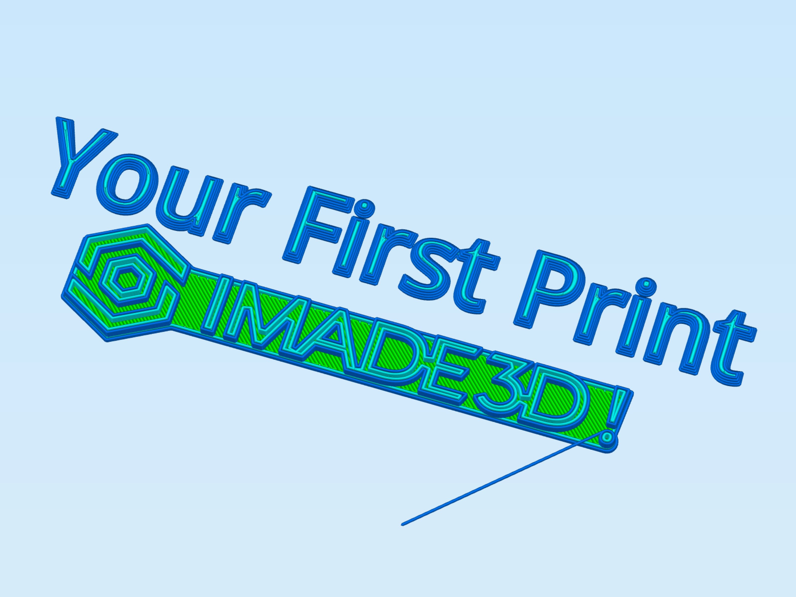

# Get Started

## Your First Print

_You’re here because you have either just built your JellyBOX or you have inherited one already built and now you want to print something, but don't know how._

_In this guide, you’ll learn how to calibrate the 1st layer height on your JellyBOX Original or 2 and launch a print from an SD card._

_Calibrating the 1st layer height is a necessary prerequisite to any successful print. This procedure will take you probably about half an hour the first time, and about 5 minutes in subsequent runs._

[filename](0-01-get-started.md ':include')

