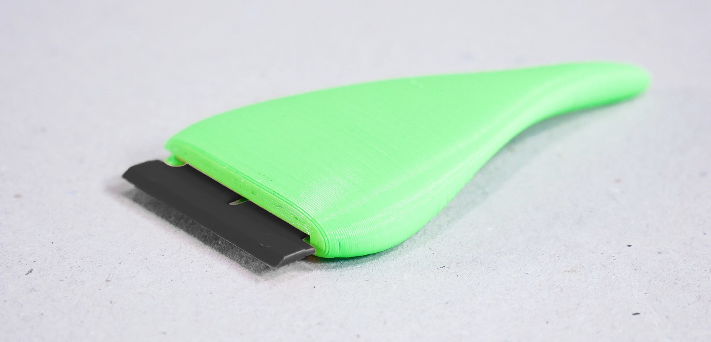
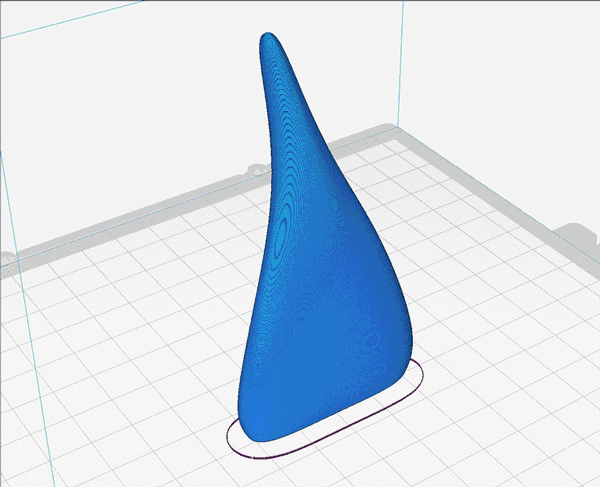
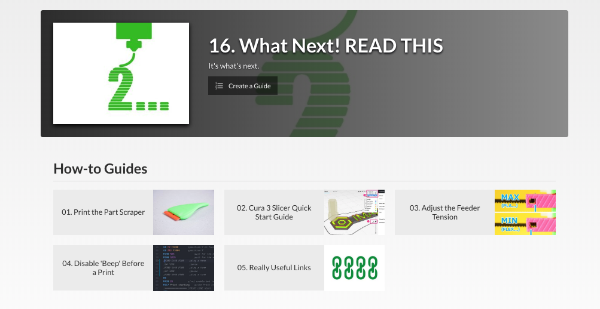

# Your First Print

Let's print an actual object before we dive into how you can prepare any 3D model for 3D printing.

## Your First Print IMADE3D Swag

We designed a our [IMADE3D First Print](go.imade3d.com/first-print) to be fast to print and with an easy-to-judge 1st layer.

> The First Print only takes a few minutes to print. It's a good first print.

The first print is in the JellyBOX Essentials on the SD card (`GCODE > 1-Your First Print`) or at [go.imade3d.com/first-print](go.imade3d.com/first-print).

## Your Second Print The Part Scraper

You may have noticed your JellyBOX came with a few plastic razor blades. These go into a Part Scraper that will help you remove parts from the build plate.

Full disclosure, plastic is not the best razor material, but the genuine [Scraperite Black Industrial](https://scraperite.com/plastic-blades-guide/use) blades that we include are capable enough, can be replaced cheaply enough, and _they will not hurt anyone_.

Given that JellyBOX is often used in school environment, we **prioritize** **safety**. Read more on the subject of Part Scrapers and power-user alternatives in the [FAQ](FAQ).

### Print your own handle

Now you get to print your own handle for these replaceable razor blades.

> The Part Scraper takes about an hour and a half to print.

Here's a [full guide on printing the Part Scraper](https://docs.imade3d.com/Guide/01.+Print+the+Part+Scraper/595) (back at docs.imade3d.com).

## Your Subsequent Prints

Obviously, you can print the pre-sliced gcodes included on your SD card in the `GCODE folder` like the popular

## Next Steps

Check out the [What's Next final section of the JellyBOX Build Guide](https://docs.imade3d.com/c/JellyBOX_2_2.1.b.b_Build_Your_JellyBOX_Kit_Makers_with_Heated_Bed_16._What_Next%21_READ_THIS?revisionid=HEAD) for to get started with Slicing with Cura (processing 3D models into gcode), useful links, and more.

