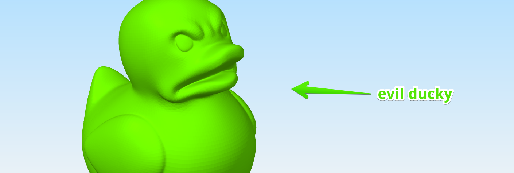

# Print All the Things!

Your first layer is now calibrated. It's time to print all the things.

## Next Steps

If you only needed to Calibrate your First Layer Height, you're done, really. Congrats.

### Your Subsequent Prints

If this is not your first 3D printing rodeo, the world is your oyster.

Obviously, print the included pre-sliced gcodes from your SD card like the popular

Check out the verified printable things on [MyMiniFactory](https://www.myminifactory.com/pages/explore), browse the [popular things on Thingiverse](https://www.thingiverse.com/explore/popular), or roam the free world of [YouMagine](https://www.youmagine.com/designs/popular).

(There are tons of other source...)

### Learn how to Slice

!> If this is your first time, **you'll need to learn how to Slice the 3D models into gcode.**
